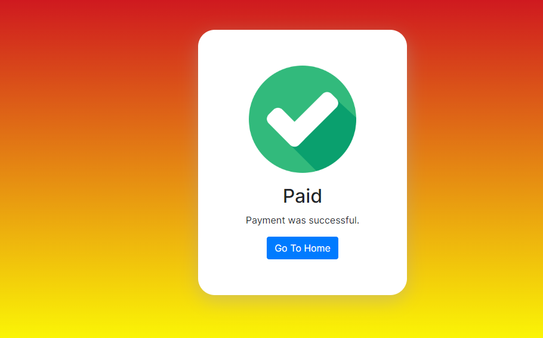

<h1 style="text-align:center;color:Orange">ReturnOrderManagement</h1>
--->we have automated the return order management through an web app, by classifying the process by repair or replacement.

<h3 style="text-align:center">Microservice Architecture</h3>
--->Microservices are a modern approach to software whereby application code is delivered in small,manageable pieces, independent of others.

<h3 style="text-align:center">System Architecture Diagram</h3>

<h3 style="text-align:center">Eureka-Server</h3>
--->Eureka Server(Service-Registry) is an application that holds the information about all client-service applications. Every Micro service will register into the Eureka server and Eureka server knows all the client applications running on each port and IP address. Eureka Server is also known as Discovery Server.

BaseURL:http://localhost:8761

<h3 style="text-align:center">Config-Server</h3>
--->Central configuration server provides configurations (properties) to each micro service connected. Spring Cloud Config Server can be used as a central cloud config server by integrating to several environments.

--->BaseURL:http://localhost:5555

<h3 style="text-align:center">API-Gateway-Service</h3>
--->Spring Cloud Gateway aims to provide a simple, yet effective way to route to APIs and provide cross cutting concerns to them such as: security, monitoring/metrics, and resiliency.

--->BaseURL:http://localhost:1001

<h3>Authentication</h3>
--->https://medium.com/@mool.smreeti/microservices-with-spring-boot-authentication-with-jwt-and-spring-security-6e10155d9db0

--->BaseURL:http://localhost:2000

<h3 style="text-align:center">ReturnOrder Portal</h3>
--->This is the web layer where users can see the frontend of the webpage to enter the credentials in login page and redirect to home page where we can enter the return order packaging details.In this microservice, I have used html,css,Javascript.For different login user to login page we need to enter logout after BaseURL.

--->BaseURL:http://localhost:3000

<h4>Login page</h4>

<h4>Create Return Request Page</h4>

<h4>Confirm your order Request page</h4>

<h4>Payment page</h4>

<h4>paid page</h4>

<h3 style="text-align:center">Packaging-delivery</h3>
--->This is the backend Calculator to process the details of the user input fields and returns to payment page.

<h3 style="text-align:center">Payment</h3>
--->This microservice stores the payment details like cardnumber,cvv,username,payment in the credits table database. To test for RestAPI Endpoints we use postman.

--->Endpoint:http://localhost:8086/h2-console
<h4>h2-console in payment Microservice</h4>

<h4>postman RestAPI Request</h4>

<h3 style="text-align:center">Component-Processing</h3>
--->This microservice invokes other microservices like portal, packaging-delivery,authentication,etc.

-------------------------------------------------------------------------------------------------------------------
<h4 style="text-align:center;color:red">How to set up this project locally in your machine?</h4>
<h6>-->we need to install a zip file from the repository.</h6>
<h6>-->we need to import all the files in eclipse or any IDE.</h6>
<h6>-->we need to add lombok.jar file externally in the properties.</h6>
<h6>-->we need to update the project forcefully in the maveen option.</h6>
<h6>-->we need to clean the project in the project option.</h6>

-------------------------------------------------------------------------------------------------------------------
<h2 style="color:DodgerBlue>Developed by: K Shankar</h2>